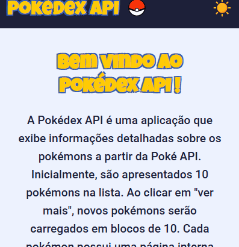

<h1 align="center">Pokédex API</h1>

O Pokédex API é um projeto que exibe uma listagem inicial de 10 Pokémons obtidos de uma API pública. Cada Pokémon possui uma página dedicada com mais detalhes, acessível ao clicar no seu card. Além disso, a aplicação oferece um botão "Ver mais" para carregar 10 novos Pokémons, permitindo expandir a lista. Também é possível filtrar os Pokémons exibidos por tipo e alternar entre os temas claro e escuro, proporcionando uma experiência personalizada ao usuário. 

  <a href="#-tecnologias">Tecnologias</a>&nbsp;&nbsp;&nbsp;|&nbsp;&nbsp;&nbsp;
  <a href="#-decisões-adotadas">Decições adotadas</a>&nbsp;&nbsp;&nbsp;|&nbsp;&nbsp;&nbsp;
  <a href="#-projeto">Projeto</a>&nbsp;&nbsp;&nbsp;&nbsp;&nbsp;&nbsp;
  

 
  <h2 align= 'center'>Desktop Version</h2>
  

  
  

  <h2 align= 'center'>Mobile Version</h2>
  

  
  

  
## 🚀 Tecnologias

Esse projeto foi desenvolvido com as seguintes tecnologias:

- HTML
- CSS
- Javascript
- API
- React
- Jest e RTL para testes 
- Git e Github

  As tecnologias utilizadas neste projeto foram essenciais para garantir uma aplicação mais escalável e bem estruturada. O React, por exemplo, sendo uma biblioteca do JavaScript, permitiu a criação de uma interface eficiente e reutilizável por meio de componentes. Além disso, o uso do Styled Components foi um grande diferencial na estilização dos componentes, tornando os estilos dinâmicos mais fáceis de gerenciar, além de facilitar a manutenção e exclusão de estilos quando um componente não for mais necessário no futuro.

  Outra tecnologia fundamental foi o Jest, combinado com o React Testing Library (RTL), que possibilitou a validação do funcionamento correto dos componentes, funções assíncronas e do Context API, garantindo maior confiabilidade no projeto.

  Por fim, ferramentas como Git foram utilizadas para versionamento do código, enquanto o GitHub permitiu armazenar e compartilhar o repositório de forma acessível, facilitando a colaboração e o gerenciamento do desenvolvimento.

## 🛠 Decisões adotadas 

  Durante o desenvolvimento deste projeto, enfrentei diversos desafios que contribuíram significativamente para o meu aprendizado.

  
  Um dos principais desafios foi o uso do Jest, pois até então, meu conhecimento sobre essa ferramenta se limitava a testes em funções de JavaScript puro. Com este projeto, aprofundei meu entendimento sobre testes em componentes, utilizando o React Testing Library (RTL). Além disso, aprendi a mockar estados e funções que armazenam informações na sessão, como o SessionStorage, além de contar com a ajuda do MSW (Mock Service Worker) para interceptar chamadas da API e facilitar a realização dos testes.

  
  Outro desafio importante foi a implementação da Context API para gerenciar o contexto de temas em toda a aplicação. Essa funcionalidade proporciona uma experiência personalizada ao usuário, permitindo a alternância entre tema claro e escuro. Para que essa implementação fosse possível, precisei me aprofundar no uso do Styled Components, criando uma estilização mais dinâmica. A mudança de tema foi realizada através do uso de props, onde os componentes recebem a prop do tema diretamente do contexto, permitindo a alteração dos estilos de forma eficiente e organizada.

  Esses desafios trouxeram um grande aprendizado, tornando o código mais estruturado, reutilizável e fácil de manter. 💡✨

## 💻 Projeto

Acesse aqui o Pokédex API

- [Acesse o projeto finalizado, online](https://pokedex-api-git-main-carlosherbertdevs-projects.vercel.app/)